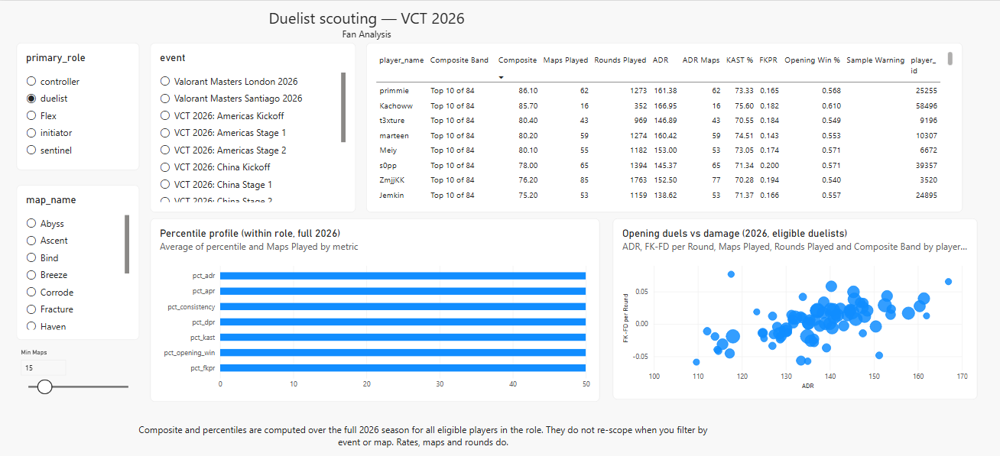
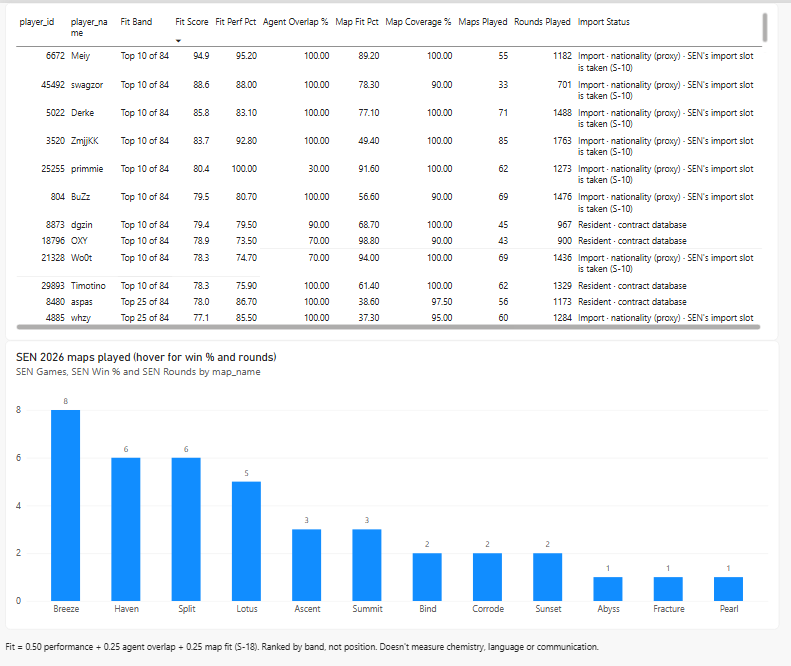
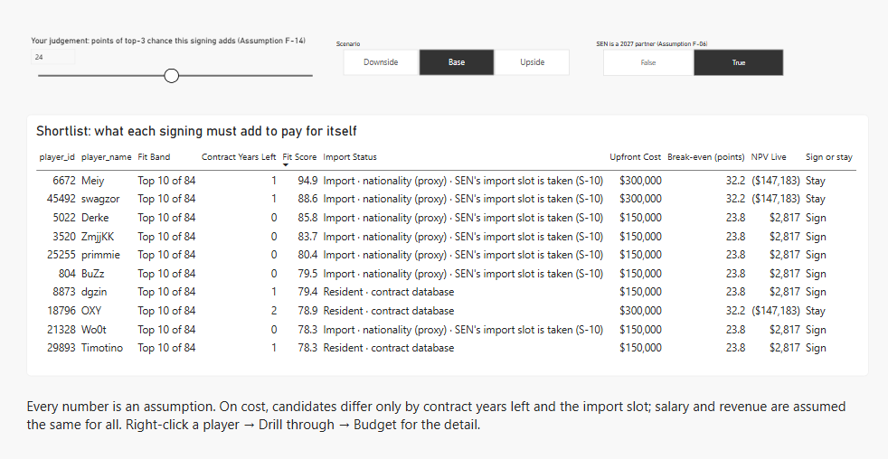
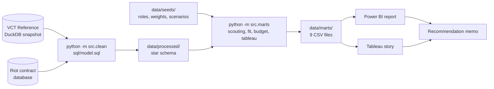

# Sentinels 2027 Duelist Signing — a VALORANT recruitment analysis

> **Unofficial fan analysis.** Not affiliated with Sentinels or Riot Games. Team facts come from public data. **Every financial number is an assumption**, not a known contract term.

A data-analysis and business-analysis portfolio project. It takes the view of a general manager and answers one question:

> **Which duelist should Sentinels sign for its vacant 2027 slot, what is that signing worth paying, and is it better than keeping a minimum-salary stand-in?**

| Deliverable | Where |
|---|---|
| **Recommendation memo** (two pages, start here) | [`docs/recommendation_memo.md`](docs/recommendation_memo.md) |
| **Tableau Public story** (five points, general audience) | [Live story](https://public.tableau.com/app/profile/triet.le3679/viz/Sentinels2027duelistsigning/WhichduelistshouldSentinelssignfor2027) · [`tableau/`](tableau/README.md) |
| **Power BI report** (five pages, analyst tool) | [`powerbi/`](powerbi/README.md) · `valorant_recruitment.pbix` |
| **Pipeline** (Python, DuckDB SQL, 61 data tests) | `src/`, `sql/`, `tests/` |
| **Business-analysis documents** | [`docs/`](#documents) |

## Key findings

Data: the VCT 2026 season before Champions (snapshot 2026-09-18). 84 duelists played at least 15 maps.

1. **The best performers are mostly not the best fits.** Only 3 of the 10 highest-scoring duelists also rank in the top fit band for this slot.
2. **Meiy, swagzor and Derke have the three highest fit scores** (94.9, 88.6 and 85.8). All three play the slot's agents and out-damage the pool on Sentinels' maps.
3. **At the Base assumptions the answer is "stay".** A signing must add 23.8 points (Derke) or 32.2 points (Meiy, swagzor) to Sentinels' chance of a top-3 season to pay for itself. The Base belief is 20.
4. **The answer flips on one judgement.** If the GM believes the signing adds 24 points or more, Derke pays for himself. If freeing an import slot costs nothing, his bar drops to 15.5 and he clears it at the Base belief.
5. **The import slot is the hard constraint.** All three are imports, and johnqt holds Sentinels' import slot. A reported rule change for 2027 may open a second slot.

The memo has the full argument, the cost of each candidate in three scenarios, and the limits.

## Screenshots

**Power BI: Scouting.** Who has performed best in the role, on metrics anyone can check.



**Power BI: Roster Fit.** Which of the 84 suit this slot's agents and Sentinels' maps.



**Power BI: Budget Overview.** What each shortlisted signing must deliver, against the GM's own belief.



**Tableau: fit score split into its three parts.**


All five Power BI pages are in [`powerbi/README.md`](powerbi/README.md), and all five story points in [`tableau/README.md`](tableau/README.md).

## How it works



One pipeline feeds both dashboards, so their numbers agree. `pytest` checks the processed tables and the marts.

**Method, in short**

- **Rates are weighted by rounds,** not averaged across maps.
- **Missing values stay blank,** never zero. Every view shows maps and rounds played.
- **Role** is the agent role a player used on at least 60% of his maps. **Eligible** means at least 15 maps in 2026.
- **Composite score:** a weighted mean of percentiles within the role (ADR, KAST, opening kills, opening duel win rate, deaths, consistency). It is shown as a band such as "Top 10 of 84", never as a rank.
- **Fit score:** 0.50 × performance + 0.25 × agent overlap + 0.25 × map fit.
- **Budget model:** compares signing with keeping a minimum-salary stand-in over a two-year contract, in Downside, Base and Upside scenarios. Its headline is the break-even: how many points of top-3 chance the signing must add. Spec in [`docs/budget_model.md`](docs/budget_model.md).

## Reproduce it

Needs Python 3.11 or newer. The raw data is not in the repo; the processed tables are rebuilt from it.

```bash
git clone https://github.com/trietsim69-boop/VCT-analysis.git
cd VCT-analysis
pip install -r requirements.txt
```

Download the two raw files into `data/raw/`, as described in [`data/raw/README.md`](data/raw/README.md). Then:

```bash
python -m src.clean      # raw snapshot -> star schema in data/processed/
python -m src.marts      # data/processed/ -> BI-ready files in data/marts/
pytest                   # 61 data tests
```

The marts in `data/marts/` are committed, so the dashboards open without running anything. The VCT Reference file is rebuilt daily at the source, so a new download will not match the 2026-09-18 snapshot number for number.

To open the dashboards, point their data sources at your copy of the repo: see [`powerbi/README.md`](powerbi/README.md) and [`tableau/README.md`](tableau/README.md).

## Data sources

| Source | Used for | Terms |
|---|---|---|
| [VCT Reference](https://vct-reference.com/dataset) (`vct.duckdb`) | All performance data: player × map stats for tier-1 VCT | Free to use, including commercially, with no warranty. Credit requested |
| [VCT Global Contract Database](https://docs.google.com/spreadsheets/d/e/2PACX-1vRmmWiBmMMD43m5VtZq54nKlmj0ZtythsA1qCpegwx-iRptx2HEsG0T3cQlG1r2AIiKxBWnaurJZQ9Q/pubhtml) (Riot Games) | Contract end year and resident or import status. No salaries | Published by Riot as a public sheet |
| [vlr.gg](https://www.vlr.gg) match pages | Spot-check of the snapshot: 600 of 600 stat cells matched across two matches | Public pages, read by hand and by `src/spotcheck_vlr.py` |
| [Esports Earnings](https://www.esportsearnings.com/games/646-valorant) | Career prize money of the shortlist, as a reference only. **Prize money is never used as salary** | Public site, free API key |
| Public reporting on VCT finances and rules | Ranges for the budget assumptions | The basis for each input is noted in [`docs/assumptions_log.md`](docs/assumptions_log.md) |

Data credit: [vct-reference.com](https://vct-reference.com), Esports Earnings and Riot Games. VALORANT is a trademark of Riot Games.

## Documents

| Document | What it is |
|---|---|
| [`docs/business_brief.md`](docs/business_brief.md) | The problem, the stakeholder, the three decisions and the outcome |
| [`docs/kpi_dictionary.md`](docs/kpi_dictionary.md) | Every metric: definition, source column, weighting |
| [`docs/assumptions_log.md`](docs/assumptions_log.md) | Every number that is not measured data, with its source and status |
| [`docs/budget_model.md`](docs/budget_model.md) | The budget model's inputs, formulas and worked cases |
| [`docs/recommendation_memo.md`](docs/recommendation_memo.md) | The recommendation and what would change it |
| [`powerbi/dax_measures.md`](powerbi/dax_measures.md) | The Power BI model, measures and verification |

## Repo layout

```
├── data/raw/          downloads, git-ignored (README says what to fetch)
├── data/processed/    star schema, git-ignored (rebuilt by src.clean)
├── data/marts/        BI-ready CSV files (committed)
├── data/seeds/        hand-kept inputs: roles, weights, budget scenarios
├── data/audit/        data-audit results: coverage, null rates, vlr.gg spot-check
├── sql/               DuckDB model and mart SQL
├── src/               Python entry points and the budget reference calculation
├── tests/             pytest data tests
├── powerbi/           report guide, measures, screenshots
├── tableau/           story workbook, guide, screenshots
├── docs/              brief, KPI dictionary, assumptions log, budget model, memo
└── valorant_recruitment.pbix   the Power BI report
```
