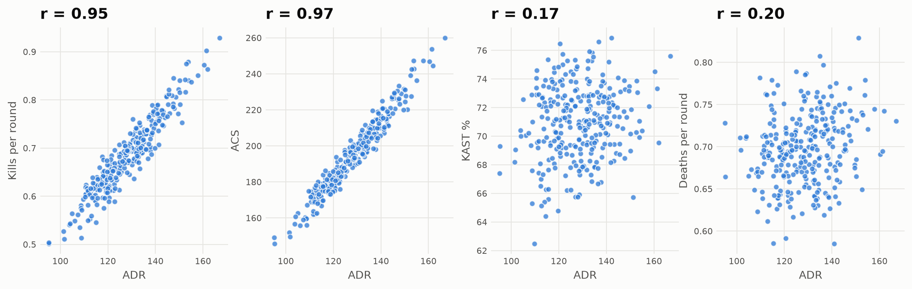

# KPI Dictionary

v0.3, 2026-09-18. Columns confirmed against the 2026-09-18 snapshot. The full mapping and null rates are in `docs/data_audit.md` §4 — ranking metrics are complete outside China; China has gaps of up to ~20%, handled by per-metric denominators below.

**Base fact:** `player_map` joined to `matches` (date, event, region, status) and `maps` (availability flags), keyed by `player_id` + `game_id`. **Rounds come from the `rounds` table**, counted per `game_id`.

**Gates:** every query filters `matches.status = 'final'` — the snapshot holds placeholder rows for unplayed fixtures (`data_audit.md` §0). **Ranking KPIs are not gated on `maps.performance_available`**: that flag covers vlr.gg's Performance tab only (multi-kills, clutches, `kill_matrix`), so it gates the display-only metrics in section C and the op-kill colour, nothing else.

**Per-metric denominators:** each rate divides by the rounds of the maps where *that* metric is non-NULL. Chinese league maps are missing ADR on ~15% of rows; dividing by all rounds would understate them, which is the NULL-as-zero error in disguise. Every rate is shown with its own map count.

**Integer storage:** `adr_all` is `SMALLINT` and `kast_all` is `TINYINT`, so raw damage and raw KAST rounds are not available. Round-weighted values are reconstructed as Σ(metric × rounds) ÷ Σ rounds and carry up to ±0.5 per map of rounding. This is accurate enough for ranking, but the formulas below are reconstructions, not exact sums.

## Conventions

- **Grain:** the base fact is one row per **player × map × match** (`fact_player_map`).
- **Window:** the ranking uses **2026 only**, and consistency uses **2025–2026**. Every KPI is filtered to top-tier VCT.
- **Weighting:** per-round rates are always **Σ numerator ÷ Σ rounds** across maps. Never average per-map rates.
- **Eligibility:** a player is ranked only with **≥ 15 maps in 2026** (`is_eligible`). This counts **all maps played**, including maps whose stats are partly missing — a missing stat is a NULL to skip, not a reason to drop the map from the sample count. Each rate then reports its own map count (see per-metric denominators above).
- **Percentiles:** computed within the role pool of eligible players only (0–100, higher = better; for "lower is better" KPIs the percentile is inverted).
- **Missing values:** NULL stays NULL. In DAX, use `DIVIDE()` and averages that ignore blanks.
- **Role:** a player's `primary_role` is the role of the agents they played on ≥ 60% of their maps; otherwise it's "Flex".
- **Import status:** Global Contract Database residency → `is_import` (a flag, not a filter).

## A. Sample and eligibility

| KPI | Definition / formula | Grain | Use | Does NOT measure |
|---|---|---|---|---|
| `maps_played` | Count of distinct maps played | Player × window | Eligibility and trust label on every visual | Quality of opposition |
| `rounds_played` | Σ rounds on those maps | Player × window | Denominator for all per-round rates | — |
| `is_eligible` | `maps_played_2026 ≥ 15`, counting all maps played | Player | Filter for ranking and percentiles | Whether the player *could* be signed, or whether every one of those maps has a full stat line |

## B. Scouting: ranking KPIs (transparent)

| KPI | Formula | Direction | Source column | Does NOT measure |
|---|---|---|---|---|
| **ADR**: average damage per round | Σ(`adr_all` × rounds) ÷ Σ rounds | ↑ | `player_map.adr_all` (reconstructed — see above) | Whether the damage led to kills or round wins |
| **KPR**: kills per round | Σ kills ÷ Σ rounds | ↑ | `player_map` kills | Kill value or timing |
| **APR**: assists per round | Σ assists ÷ Σ rounds | ↑ | `player_map` assists | Quality of utility |
| **DPR**: deaths per round | Σ deaths ÷ Σ rounds | ↓ | `player_map` deaths | Whether a death was a useful trade |
| **KAST %** | Rounds with a Kill, Assist, Survival or being Traded ÷ rounds (round-weighted from per-map KAST) | ↑ | `player_map` KAST | Communication or teamwork. It's a per-round involvement flag only. |
| **FKPR**: first kills per round | Σ first kills ÷ Σ rounds | ↑ (role-dependent) | `player_map` / `kill_matrix` opening kills | Whether the entry was part of a planned play |
| **FDPR**: first deaths per round | Σ first deaths ÷ Σ rounds | ↓ (role-dependent) | same | — |
| **Opening duel win %** | FK ÷ (FK + FD) | ↑ | derived | How many opening duels the player *should* take |
| **FK–FD per round** | (FK − FD) ÷ Σ rounds | ↑ | derived | — |
| **Consistency (ADR CV)** | Standard deviation of per-map ADR ÷ mean per-map ADR, across 2025–2026 maps | ↓ | derived | Consistency over time *within* a map |

### Composite weights (T4.1, set 2026-09-21)

The ranking is a **role-weighted composite of percentiles**. Weights live in `data/seeds/metric_weights.csv` — data, not code — and each role's weights sum to 1.

| Metric | duelist | initiator | controller | sentinel | Flex |
|---|---|---|---|---|---|
| `adr` | 0.25 | 0.20 | 0.15 | 0.20 | 0.20 |
| `apr` | — | 0.20 | 0.25 | 0.15 | 0.15 |
| `kast_pct` | 0.15 | 0.25 | 0.30 | 0.25 | 0.20 |
| `fkpr` | 0.20 | — | — | — | 0.10 |
| `opening_win_pct` | 0.20 | 0.10 | — | — | 0.10 |
| `dpr` ↓ | 0.10 | 0.10 | 0.15 | 0.20 | 0.15 |
| `cv_adr` ↓ | 0.10 | 0.15 | 0.15 | 0.20 | 0.10 |

↓ = lower is better; the percentile is inverted in T4.4. Direction lives in the mart SQL, not the seed, so it is defined once.

**Only 6–7 of the section B metrics are weighted, not all 10.** Measured over the 2026 pool (≥ 15 maps, n = 289):

- **KPR and ACS are dropped.** They correlate with ADR at **0.95** and **0.97** — weighting all three is one metric counted three times. ADR is the transparent one, so it carries the output signal alone. (ACS is display-only anyway, S-09.)
- **FKPR and opening-duel win % are both kept**: they correlate at only **0.41**, so entry *volume* and entry *success* are genuinely different things. That distinction is the whole question for the vacant duelist slot — Jerrwin's baseline is high volume at a near-break-even win rate (`data_audit.md` §2).
- **KAST and DPR are near-independent of ADR** (0.17 and 0.20), so they add real information about staying alive and being useful in rounds without fragging.
- **FK−FD per round is dropped** as a third view of the same duel data.
- APR is weighted for the support roles only; for a duelist it mostly measures the team's utility, not the player's.

*Each dot is one player with ≥ 15 maps in 2026 (n = 289). KPR and ACS sit on a line with ADR — the same signal three times, so only ADR is weighted. KAST and DPR are shapeless clouds against it, so they earn their own weights.*

**The weight values themselves are a judgement call, not a measurement.** The correlations above justify *which* metrics are weighted; they say nothing about why duelist ADR is 0.25 rather than 0.20. The stated rationale is only this: for the vacant duelist slot, entry play (FKPR + opening-win, 0.40 combined) is the thing SEN needs and is weighted above raw output (ADR, 0.25); support roles shift that weight onto KAST and APR.

**Sensitivity check (2026 duelist pool, n = 84).** The composite was recomputed under three weightings — the table above, flat equal weights, and a deliberately lopsided one putting 0.50 on ADR:

| | Correlation of composite scores |
|---|---|
| Table above vs equal weights | **0.978** |
| Table above vs ADR-heavy | **0.969** |
| Equal weights vs ADR-heavy | 0.932 |

Top-10 overlap: 8/10 and 7/10 respectively, with the same player first under all three.

**What this means, and the limit on how the ranking may be read:**

- **Shortlist membership is robust.** Who reaches the top of the pool is driven by the percentiles, not by the weighting. A reader who disagrees with every weight in the table still gets substantially the same candidates.
- **Rank order within the shortlist is not.** Jemkin ranks 8th under these weights and 22nd under the ADR-heavy set; splash moves between 6th and 15th. So the composite must be presented as a **band, not a position** — "top 10 of 84", never "the 8th best duelist". T4.4 and T11 both depend on this.

## C. Scouting: display-only KPIs

| KPI | Formula | Why display-only |
|---|---|---|
| **Rating** (third-party) | As provided by the source | A proprietary composite that we can't break down, so it's shown for recognition only |
| **ACS**: average combat score | Round-weighted ACS | Overlaps with ADR and KPR, and Riot's scoring formula isn't under our control |
| **HS %** | Headshot hits ÷ total hits | A mechanics indicator with a weak link to winning rounds |
| **Clutches won per 100 rounds** | (`clutch_1v1` + … + `clutch_1v5`) ÷ rounds × 100 | The database stores clutches won but no attempts, so a success *rate* can't be computed. Always shown with the raw count. |

## D. Roster fit

| KPI | Formula | Grain | Does NOT measure |
|---|---|---|---|
| **Role share %** | Maps on agents of role R ÷ maps played | Player | Proficiency on each agent |
| **Agent pool size** | Distinct agents with ≥ 3 maps in the window | Player | Whether the player could learn a new agent |
| **Agent overlap %** | The share of the slot's 2026 maps (Jerrwin on SEN, by agent: neon 18, waylay 9, raze 3 — S-17) that were on agents the candidate has played ≥ 3 times in 2026. Map-weighted. | Candidate × SEN | Performance on those agents |
| **Map fit (ADR vs own average)** | Per map: candidate ADR − duelist-pool ADR on that map. That gap averaged with weight SEN games × candidate rounds, **minus** the same gap averaged by candidate rounds alone. Positive = he out-damages the pool by more on SEN's maps than he does in general. | Candidate × SEN | His team's results on those maps, or whether he would win them for SEN |
| **Map coverage %** | SEN's 2026 games on maps the candidate has played ÷ all SEN 2026 games. Display only. | Candidate × SEN | How well he plays them |
| **SEN map win %** | SEN maps won ÷ maps played, per map (2026) | Team × map | Why SEN won or lost those maps |
| **KPI delta vs slot baseline** | Candidate KPI − Jerrwin's 2026 KPI (S-16), for ADR, KAST, FKPR, opening win %, DPR and CV. For DPR and CV a negative delta is better. | Candidate | The expected change in results. That needs the stretch model and its ranges. |
| **Fit score** | Weighted mean, 0–100, of: **performance** (percentile of the scouting composite), **agent overlap %** (used as-is: 30 of 84 tie at 100%, and a percentile would score them 65) and **map fit** (percentile). Weights in `data/seeds/fit_weights.csv` (S-18). | Candidate × SEN | Chemistry, language or communication |
| **Import flag** | `is_import_for_sen`: Non-Resident in Riot's contract database (Americas tab) when listed; otherwise nationality outside the Americas. `import_source` names the rule used (S-19). | Candidate | Eligibility beyond the one-import rule |

**Why map fit is measured against the player's own average.** The first build used the SEN-weighted gap alone (candidate ADR − pool ADR on SEN's maps). It correlated **0.96** with overall ADR — the same signal already inside `performance`, counted twice. Subtracting the player's own average leaves only the map-specific part (r = −0.03 with ADR). A test guards this.

**Why no team win rate feeds the score.** A candidate's map win rate was earned with four other players. It is shown on the Roster Fit page, never scored.

**What the fit score does not do.** It says who has played well, on the right agents and on SEN's maps. It does not predict SEN's results with that player; that would need a win model with stated uncertainty, which this project did not build.

## E. Budget scenarios (all inputs are assumptions)

**The formulas live in `budget_model.md` §6** (the spec, settled in T8 on 2026-09-29). Input values are in `assumptions_log.md` § B. This section used to hold the v0.1 formulas; they were replaced because:

- **Payback** divided the incremental cost by the yearly uplift, which treated salary paid every year as if it were paid upfront. It is now upfront cost ÷ net gain per year.
- **Break-even** ignored discounting. It is now ΔS + C₀ ÷ AF, which equals the old formula when *r* = 0.
- **Max justifiable spend (D2)** was a *total*. It is now the maximum *upfront* spend (buyout + import-slot cost) with NPV ≥ 0.
- **Scenarios** are one axis, Downside / Base / Upside (worst to best case for signing), with 2027 partner status as a separate toggle.
- **Added:** import-slot net cost (F-13), added top-3 chance (F-14), non-partner payments (F-15), the break-even top-3 chance and a "not within contract" payback flag. F-13 and F-14 were reworded in the T8 review (2026-10-01).
- **Headline:** the break-even top-3 chance, not the NPV sign. It is each player's bar; the GM's judgement (F-14) is compared against it.

Outputs, in short: total acquisition cost, baseline cost, incremental cost, NPV of signing vs staying, break-even uplift per year, break-even top-3 chance, payback, maximum justifiable upfront spend (D2) and the sign-or-stay decision (D3).

**Does NOT measure:** actual salaries, actual buyouts or the real value of the organisation. Every output depends on the assumptions and is labelled that way.

## Closed in Task 2 (2026-09-18)

- [x] Columns mapped: `adr_all`, `kast_all`, `fk_all`, `fd_all`, `acs_all`, `rating_all`, `hs_pct_all`, `agents`.
- [x] Clutch attempts don't exist → clutch success % replaced by clutches won per 100 rounds.
- [x] First kills and deaths sit in `player_map` (`fk_all`, `fd_all`) and per-opponent in `kill_matrix`.
- [x] Agent → role seed written to `data/seeds/agent_roles.csv` (29 agents, including the 2026 releases veto and miks).
- [x] Attack/defence splits exist for ADR, ACS, KAST and first kills. Kept out of v1 ranking, available for Roster Fit.
