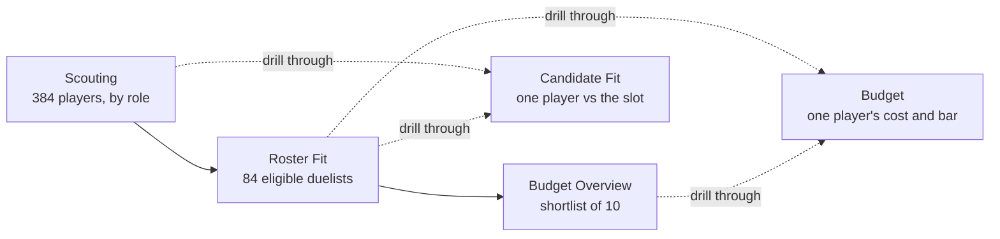
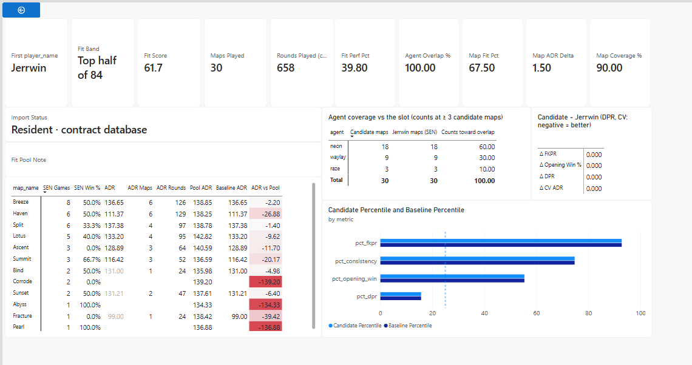
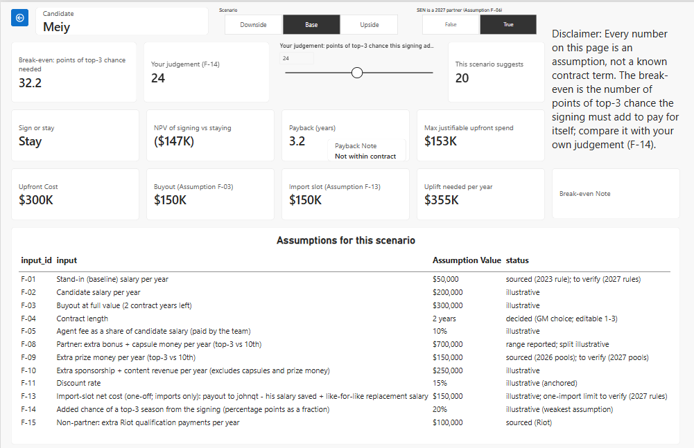
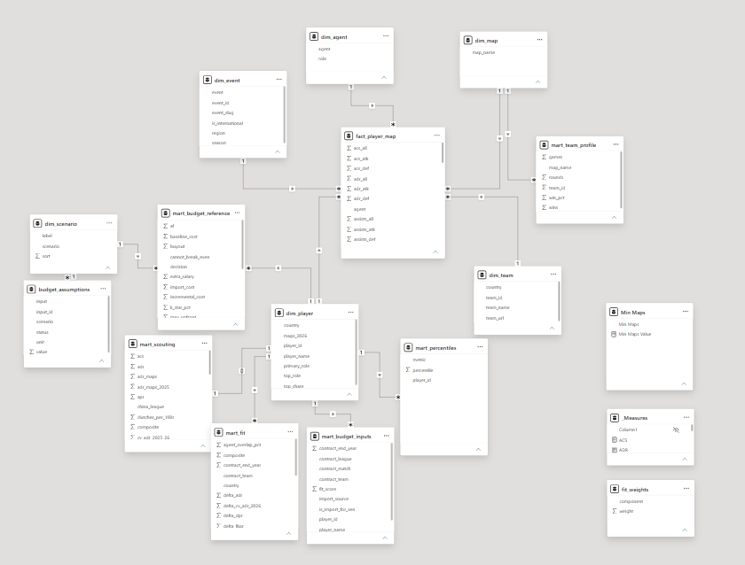

# Power BI Report — Sentinels 2027 Duelist Signing

> **Unofficial fan analysis.** Not affiliated with Sentinels or Riot Games. Team facts come from public data. **Every financial number is an assumption**, not a known contract term.

| | |
|---|---|
| **File** | [`valorant_recruitment.pbix`](../valorant_recruitment.pbix) (repo root), built in Power BI Desktop, Import mode |
| **Question** | Which duelist should Sentinels sign for its vacant 2027 slot, and what is that signing worth paying? |
| **Data** | `data/processed/`, `data/marts/` and `data/seeds/`, built by `python -m src.clean` and `python -m src.marts` |
| **Snapshot** | VCT Reference, 2026-09-18: the 2026 season **before Champions**. Screenshots taken 2026-10-02 |
| **Build reference** | [`dax_measures.md`](dax_measures.md): every measure, the fields behind each visual, verification and open items |

---

## How the report answers the question

The business brief asks three things. Each has a place in the report.

| Decision | Where | What you do there |
|---|---|---|
| **D1. Who is on the shortlist?** | Scouting → Roster Fit → Candidate Fit | Rank duelists on transparent metrics, then check each one against SEN's agents and maps |
| **D2. What is the most SEN can justify paying up front?** | Budget | Read "Max justifiable upfront spend" for the candidate |
| **D3. Sign, or stay with a stand-in?** | Budget Overview, Budget | Compare each player's break-even bar with your own judgement |

To drill through, right-click a player's row and choose **Drill through**. The Back button (top left) returns to where you came from.

---

## 1. Scouting

**What it answers:** who has performed best in the role this season, on metrics anyone can check.

- **The table** lists players in the selected role, sorted by a composite score. The composite is a weighted mean of percentiles, computed within the role. For duelists there are six: ADR, KAST, opening kills, opening duel win rate, deaths and consistency. vlr.gg's Rating and ACS exist as display measures but are never used for ranking.
- **Composite Band** is the result to read. It says "Top 10 of 84", never "8th best": the gap between neighbouring ranks is not evidence of anything.
- **The scatter** plots damage (ADR) against opening duels won minus lost per round. Bubble size is maps played, so a strong line built on few maps is visible at a glance.
- **The percentile bars** describe one player. Click a row in the table first; with nobody selected they show the pool average, which is 50 by construction.

**Things to know**

- The role slicer starts on duelist. The composite is not comparable across roles.
- **Min Maps** starts at 15, the eligibility bar. Players under it carry a sample warning.
- Event and map slicers change the rates, maps and rounds. They do **not** change the composite or the percentiles, which cover the full 2026 season. The note at the bottom of the page says so.

## 2. Roster Fit

**What it answers:** which of the 84 eligible duelists suit this particular slot.

- **Fit Score** = 0.50 × performance + 0.25 × agent overlap + 0.25 × map fit. It is shown as a band, like the composite.
- **Agent Overlap %** is the share of the slot's 2026 maps (neon, waylay, raze) that were on agents the candidate also plays.
- **Map Fit** asks whether the candidate out-damages the pool by more on SEN's maps than he does in general. It is measured against his own average so that it doesn't count overall ADR twice.
- **Import Status** says whether signing him would need SEN's single import slot, which johnqt already holds, and which rule set the flag: Riot's contract database, or nationality as a stand-in.
- **The chart** shows how often SEN played each map in 2026. Hover for win rate and rounds.

**Things to know**

- The fit score says who has played well, on the right agents and on SEN's maps. It does not measure chemistry, language or communication.
- Import status that rests on nationality is a proxy and is confirmed by hand before the recommendation.

## 3. Candidate Fit

**What it answers:** how one candidate compares with the player he would replace. The baseline is Jerrwin, who held the slot in 2026.

- **Header cards:** the fit score, its three components and the sample size.
- **Map table:** the candidate's ADR on each SEN map, next to the duelist pool's ADR and Jerrwin's. A grey ADR means fewer than 3 maps there.
- **Agent table:** the candidate's maps on each of the slot's agents, and the overlap they add up to.
- **Δ table and bars:** opening duels, deaths and consistency against Jerrwin. The dashed line at the 25th percentile marks replacement level for a duelist.

The screenshot shows Jerrwin drilled in against himself, which is the page's self-check: every Δ is 0.000 and his ADR equals the baseline on every map.

## 4. Budget Overview

**What it answers:** for the ten shortlisted players, what each signing must deliver to pay for itself.

- **Break-even (points)** is each player's **bar**: the number of percentage points he must add to SEN's chance of a top-3 season for the signing to pay for itself, against keeping a minimum-salary stand-in.
- **The slider** is your **belief**: how many points you judge the signing adds (assumption F-14). A player reads **Sign** when your belief clears his bar.
- **Scenario** (Downside / Base / Upside) changes the costs and the value of a top-3 season. **Partner** switches whether SEN keeps its 2027 partner status.

In the screenshot the slider is at 24. Seven players have a bar of 23.8 and read Sign; Meiy, swagzor and OXY have a bar of 32.2 and read Stay.

**Things to know**

- **The model does not rank players.** On cost, candidates differ only by contract years left (the buyout) and the import slot. Salary and revenue are assumed the same for everyone, because no salary data exists.
- That is why the bars come in two groups here rather than ten different values.

## 5. Budget

**What it answers:** the full cost picture for one candidate. Reach it by drilling through from any page with a player table.

| Row | What it shows |
|---|---|
| Bar and belief | The break-even next to your judgement, with the slider. "This scenario suggests" is the value the scenario would use by default |
| Outcome | Sign or stay, the NPV of signing against staying, the payback period, and the most SEN could pay up front and still break even |
| Costs | The upfront cost, split into the buyout and the cost of freeing the import slot, plus the revenue uplift needed per year |
| Assumptions | All twelve inputs for the selected scenario, each with its ID and how well it is sourced |

In the screenshot Meiy needs 32.2 points and the slider is at 24, so the page says Stay. Half of his $300K upfront cost is the import slot.

**Things to know**

- Payback is a simple (undiscounted) count of years; NPV is discounted. Near the bar they can disagree.
- "Not within contract" means the payback is longer than the two-year deal.
- Inputs are defined in [`docs/budget_model.md`](../docs/budget_model.md) and sourced in [`docs/assumptions_log.md`](../docs/assumptions_log.md) § B.

## 6. QA

A check page, not part of the story. It holds a reconciliation table for three players (Jerrwin, ZmjjKK, Kachoww) whose 39 values match `mart_scouting.csv` exactly. It is the quickest test that a data refresh loaded cleanly. The numbers are in [`dax_measures.md`](dax_measures.md) § 5.

---

## Data model

A star schema: one fact table, dimensions around it, and marts that hold numbers computed once in SQL and Python.

| Role | Tables |
|---|---|
| **Fact** | `fact_player_map`: one row per player × map × match, all seasons |
| **Dimensions** | `dim_player`, `dim_team`, `dim_event`, `dim_map`, `dim_agent`, `dim_scenario` |
| **Marts** | `mart_scouting`, `mart_percentiles`, `mart_fit`, `mart_team_profile`, `mart_budget_reference`, `mart_budget_inputs`, `budget_assumptions` |
| **Helpers** | `_Measures` (all DAX measures), `Min Maps` and `F14` (sliders), `fit_weights` (QA only) |

Three rules shape it:

1. **Filters flow one way,** from a dimension to the fact table or a mart. Nothing filters back up.
2. **Scores are read, not recalculated.** The composite, the fit score and the break-even come from the marts, so they agree with the tested pipeline and do not shift when a slicer narrows the data.
3. **Rates are recalculated,** weighted by rounds, so ADR and the like respond to the event and map slicers.

Table sizes, relationships and data types are in [`dax_measures.md`](dax_measures.md) § 1, § 7 and § 8.

---

## Opening and refreshing the file

1. Open `valorant_recruitment.pbix` in Power BI Desktop.
2. The file reads CSVs by absolute path (`D:\VCT\data\...`). On another machine, go to **Transform data → Data source settings → Change Source** and point each source at your copy of the repo.
3. After rebuilding the data (`python -m src.clean`, then `python -m src.marts`), click **Home → Refresh**. Then check the QA page.

## Reading rules

- **Sample size is always shown.** Maps and rounds played sit beside every rate.
- **Bands, not positions.** "Top 10 of 84", never a rank number.
- **Blank means no data,** never zero.
- **Finance is assumption-driven.** Each input carries an ID (F-01 to F-15) that traces to the assumptions log. Prize money is never used as salary.
- **The snapshot is pre-Champions.** Everything is rerun after Champions 2026 ends (2026-10-18), and the shortlist may change.

Open items for the report are listed in [`dax_measures.md`](dax_measures.md) § 6, § 7 and § 8.
