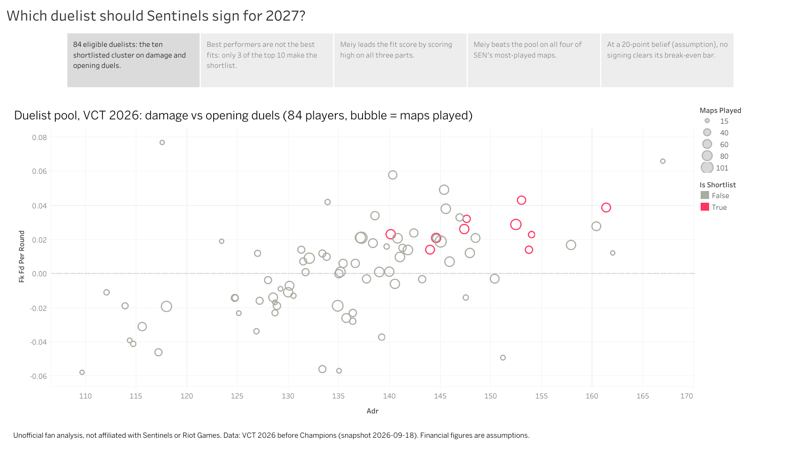
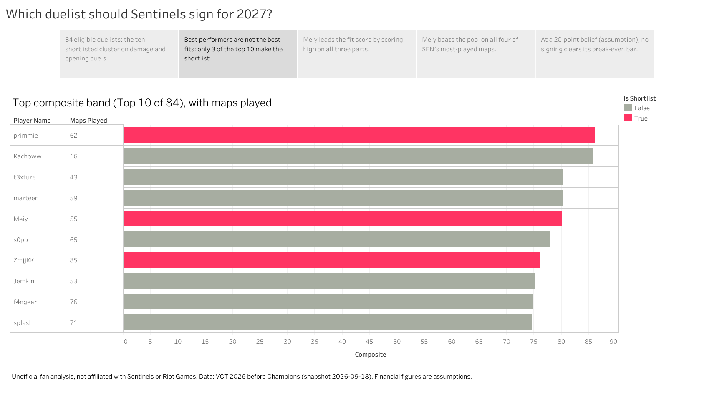
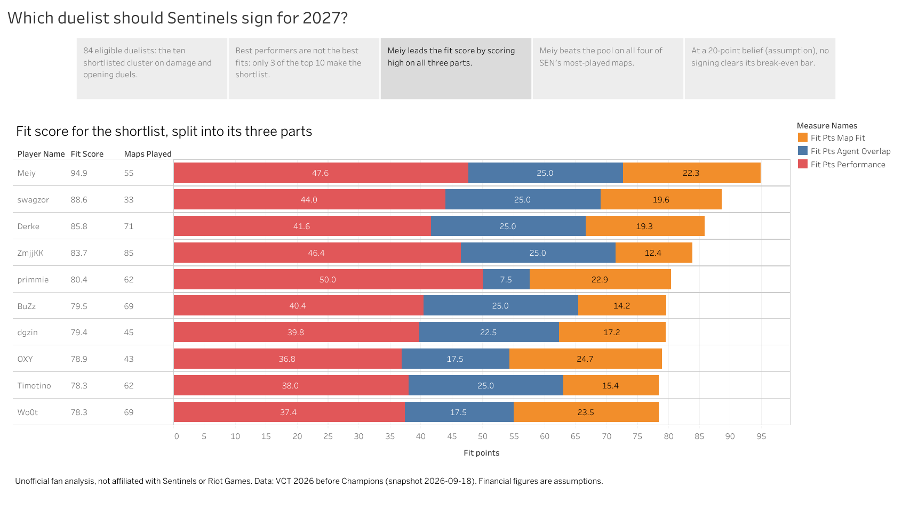
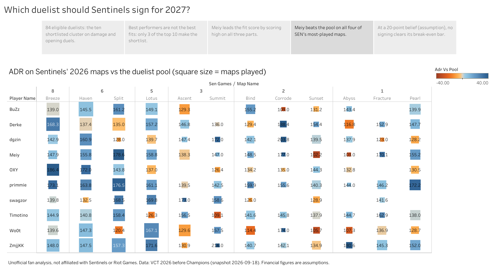
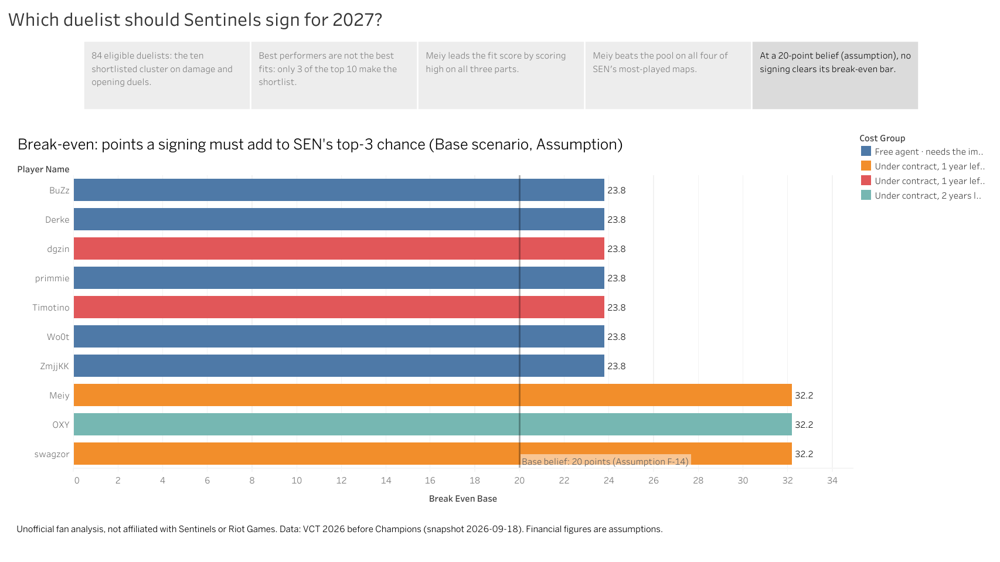

# Tableau Public Story — Sentinels 2027 Duelist Signing

> **Unofficial fan analysis.** Not affiliated with Sentinels or Riot Games. Team facts come from public data. **Every financial number is an assumption**, not a known contract term.

| | |
|---|---|
| **Live story** | [Which duelist should Sentinels sign for 2027?](https://public.tableau.com/app/profile/triet.le3679/viz/Sentinels2027duelistsigning/WhichduelistshouldSentinelssignfor2027) on Tableau Public |
| **File** | `sen_duelist_story.twb` (this folder), built in Tableau Public Desktop |
| **Question** | Which duelist should Sentinels sign for its vacant 2027 slot, and what must that signing deliver? |
| **Data** | Three flat files in `data/marts/`, written by `python -m src.marts` |
| **Snapshot** | VCT Reference, 2026-09-18: the 2026 season **before Champions**. Published 2026-10-03 |
| **Analyst version** | The Power BI report in [`../powerbi/`](../powerbi/README.md), with slicers, drill-through and the budget slider |

The story tells the scouting and fit findings to a general audience in five steps. It has no slicers: each step makes one point.

---

## The story in five points

| # | Story point | Takeaway, as captioned | Sample size shown as |
|---|---|---|---|
| 1 | The pool | 84 eligible duelists: the ten shortlisted cluster on damage and opening duels | Bubble size = maps played |
| 2 | Who rises to the top | Best performers are not the best fits: only 3 of the top 10 make the shortlist | Maps played beside each name |
| 3 | Who fits this slot | Meiy leads the fit score by scoring high on all three parts | Maps played beside each name |
| 4 | SEN's maps | Meiy beats the pool on all four of SEN's most-played maps | Square size = maps played on that map |
| 5 | What a signing must deliver | At a 20-point belief (assumption), no signing clears its break-even bar | Not a sample: assumption-driven |

### 1. The pool

- Each circle is one of the **84 duelists with at least 15 maps** in 2026.
- Across: damage per round (ADR). Up: opening duels won minus lost, per round.
- A bigger circle means more maps played, so a strong line on few maps is easy to spot.
- Pink marks the shortlist: the ten players in the top fit band.

### 2. Who rises to the top

- The ten best duelists by composite score, the "Top 10 of 84" band. The composite ranks performance only.
- Only three are also on the shortlist (pink): primmie, Meiy and ZmjjKK.
- Kachoww is second on **16 maps**, one above the minimum. The maps column is there so that is visible.

### 3. Who fits this slot

- Fit score = 0.50 × performance + 0.25 × agent overlap + 0.25 × map fit. Each bar stacks the points from the three parts, with the total and maps played beside the name.
- Meiy: 47.6 + 25.0 + 22.3 = **94.9**.
- primmie has the best performance (50.0) but only 7.5 of 25 on agents: he rarely plays the agents this slot uses.
- Each part is rounded on its own, so a stack can differ from the total by 0.1.

### 4. SEN's maps

- Columns are the 12 maps Sentinels played in 2026, most played first. The number above each map is SEN's games on it.
- The number in a cell is the player's ADR on that map. Colour is the gap to the 84 duelists' ADR on the same map: blue above, orange below, capped at ±40.
- A bigger square means more maps played there. The smallest squares are 1 or 2 maps and prove little.
- A blank cell means he did not play that map in 2026.
- Meiy is above the pool on Breeze (147.9 against 138.9), Haven, Split and Lotus.

### 5. What a signing must deliver

- Each bar is a player's **break-even**: the percentage points he must add to SEN's chance of a top-3 season for the signing to pay for itself, against keeping a minimum-salary stand-in. Base scenario, SEN a partner team.
- The line at 20 is the Base belief of what a signing adds (assumption F-14). No bar is shorter than the line, so at that belief the answer is "stay" for everyone.
- Seven players need **23.8** points ($150K upfront) and three need **32.2** ($300K upfront): Meiy, swagzor and OXY.
- Colour gives the reason for the cost: contract years left and whether he needs SEN's import slot.
- **The model does not rank players.** Salary and revenue are assumed the same for everyone, so the bars come in two groups. Inputs are in [`docs/budget_model.md`](../docs/budget_model.md).

---

## Parity with Power BI

Five headline numbers, read from the published story on 2026-10-03 and compared with the values verified in Power BI ([`../powerbi/dax_measures.md`](../powerbi/dax_measures.md) § 5, § 7 and § 8). The pool ADR in row 4 is in the chart's tooltip.

| # | Number | Tableau | Power BI | Match |
|---|---|---|---|---|
| 1 | Eligible duelists in the pool | 84 (story point 1) | 84 (Roster Fit, "of 84" bands) | Yes |
| 2 | Maps played: Kachoww, ZmjjKK | 16, 85 (story point 2) | 16, 85 (QA page) | Yes |
| 3 | Meiy's fit score | 94.9, first on the shortlist (story point 3) | 94.9, Top 10 of 84 (Roster Fit) | Yes |
| 4 | Meiy's ADR on Breeze and Split, pool ADR, SEN games | 147.9 vs 138.9, 8 games; 178.6 vs 138.8, 6 games (story point 4) | Same (Candidate Fit map table) | Yes |
| 5 | Break-even, Base, partner | 23.8 for seven players; 32.2 for Meiy, swagzor, OXY (story point 5) | Same (Budget Overview) | Yes |

The two tools agree by construction: both read files written by the same tested pipeline, and the workbook has **no calculated fields**. `tests/test_tableau.py` pins the Tableau files to the values checked in Power BI.

---

## How it is built

- **Three data sources, connected separately** (not joined). Each sheet uses one file only.
- **Five sheets → five dashboards → one story.** A dashboard is one sheet plus the "unofficial fan analysis" line.
- **Size:** the story is fixed at 1366 × 768 and each dashboard is sized to fit inside it.
- **Sums are not sums.** Tableau wraps every measure in SUM, but each mark is one row of the file, so the value shown is the row's own value.

### Differences from the plan

- Low samples on the map chart are shown by **square size** instead of being greyed out. `low_sample` is still in the file.
- The map chart's colour is capped at ±40 ADR so that 1-map results (ZmjjKK on Summit, +79.4) do not wash out the rest.
- `tableau_percentiles.csv` is connected but not used in the story.

### Refresh and republish

1. Rebuild the data: `python -m src.clean`, then `python -m src.marts`.
2. Open `sen_duelist_story.twb`. If the files moved, repoint the three sources to your `data/marts/` (**Data → [source] → Edit Data Source**).
3. Refresh each source (**Data → [source] → Refresh**), check the five story points, then **File → Save to Tableau Public**. Saving under the same name keeps the link.

Due after the post-Champions re-snapshot (after 2026-10-18). The shortlist may change.

---

## Data files

Tableau can't reuse Power BI's DAX, so everything DAX computed is written to three flat files by `sql/mart_tableau.sql` (part of `python -m src.marts`). They are read from the same tested marts. All three cover the **84 eligible duelists** of the 2026 season before Champions.

| File | One row per | Rows | Feeds |
|---|---|---|---|
| `tableau_candidates.csv` | duelist | 84 | Story points 1, 2, 3 and 5 |
| `tableau_maps.csv` | duelist × SEN map | 1,008 | Story point 4 |
| `tableau_percentiles.csv` | duelist × metric | 588 | Not used in the story; the percentile profile of one player |

All three share `player_id`, `player_name`, `fit_band`, `is_shortlist` and `is_baseline`.

### `tableau_candidates.csv`

| Columns | Meaning |
|---|---|
| `maps_played`, `rounds_played`, `adr_maps` | Sample size. Show it beside every rate |
| `adr`, `kast_pct`, `fkpr`, `fdpr`, `opening_win_pct`, `dpr`, `cv_adr_2026` | 2026 rates, weighted by rounds |
| `fk_fd_per_round` | Opening kills minus opening deaths, per round |
| `composite`, `composite_band` | Scouting score and its band ("Top 10 of 84"). Show the band, not a rank |
| `fit_score`, `fit_band` | Fit for SEN's slot and its band |
| `fit_pts_performance`, `fit_pts_agent_overlap`, `fit_pts_map_fit` | Points each component adds to the fit score. Stack them; they sum to `fit_score` (± 0.1) |
| `pct_performance`, `agent_overlap_pct`, `pct_map_fit`, `map_adr_delta`, `map_coverage_pct` | The fit components before weighting |
| `is_import_for_sen`, `import_source` | Would he need SEN's import slot, and which rule says so |
| `contract_team`, `contract_end_year`, `years_left`, `contract_match` | From Riot's contract database |
| `upfront_base`, `break_even_base` | Base scenario, SEN a partner: upfront cost in USD, and the points of top-3 chance the signing must add to pay for itself. **Assumption-driven** |
| `cost_group` | Why the cost is what it is, in words: contract status and import slot |
| `is_shortlist` | The top-10 fit band |
| `is_baseline` | Jerrwin, who held the slot in 2026 |

### `tableau_maps.csv`

| Columns | Meaning |
|---|---|
| `map_name`, `sen_games`, `sen_win_pct`, `sen_rounds` | SEN's 2026 record on the map |
| `adr`, `adr_maps`, `adr_rounds` | The player's ADR there and its sample. Blank if he hasn't played it |
| `pool_adr`, `adr_vs_pool` | The 84 duelists' ADR on that map, and the player's gap to it |
| `low_sample` | True under 3 maps |

### `tableau_percentiles.csv`

| Columns | Meaning |
|---|---|
| `metric`, `metric_label` | The metric and a readable name |
| `percentile` | 0–100 within the 84. Higher is always better; deaths and consistency are already inverted |
| `composite_weight` | The metric's weight in the composite. Blank = shown but not weighted (assists) |

## Reading rules

- **Sample size is shown** wherever a rate is. Bands, not rank numbers. Blank means no data, never zero.
- **The break-even is an assumption-driven bar, not a forecast.** Prize money is never used as salary.
- **The snapshot is pre-Champions.** Everything is rerun after Champions 2026 ends (2026-10-18).
